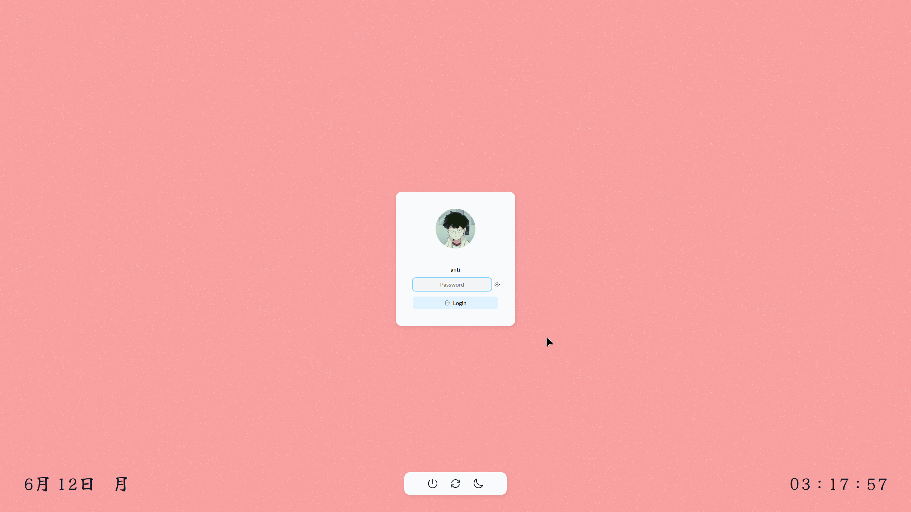

# lightdm-weeb-minimal
## Summary
A lightdm greeter based on [lightdm-gab-gradient](https://github.com/GabrielTenma/lightdm-gab-gradient), customized a bit for your minimal weeb needs. See the [live demo](https://fredrare.github.io/lightdm-weeb-minimal).

## Features
- Apple-styled shadows and corners
- Fractal noise-based aesthetic pastel background
- Date in japanese - [Yuji Syuku font](https://fonts.google.com/specimen/Yuji+Syuku)
- Time with seconds - [Yuji Syuku font](https://fonts.google.com/specimen/Yuji+Syuku)
- Multi-user
- Anti-shoulder-surfing ultra-secure password field - [IBM Plex Mono font](https://fonts.google.com/specimen/IBM+Plex+Mono)
- Keyboard-navigation support
- Built-in fonts: [Lato](https://fonts.google.com/specimen/Lato), [Yuji Syuku](https://fonts.google.com/specimen/Yuji+Syuku) and [IBM Plex Mono](https://fonts.google.com/specimen/IBM+Plex+Mono)

## Screenshot


## Installation guide
These are commands for [Arch Linux](https://archlinux.org), although you can do pretty much the same for any distro.
1. Install  [`lightdm`](https://github.com/canonical/lightdm) and [`web-greeter`](https://github.com/JezerM/web-greeter).
```sh
# Remember to update your system, pls
sudo pacman -Syu

# Now, you can proceed
sudo pacman -S lightdm
yay -S web-greeter
```
2. Enable `lightdm`.
```sh
sudo systemctl enable lightdm
```
3. In the terminal, navigate to `/usr/share/web-greeter/themes`.
```sh
cd /usr/share/web-greeter/themes
```
4. Clone this repository.
```sh
sudo git clone https://github.com/fredrare/lightdm-weeb-minimal.git weeb-minimal
```
5. Enable the theme in your `/etc/lightdm/web-greeter.yml` by going to the `greeter` section, finding the `theme` variable and replacing its value with `weeb-minimal`.
6. Edit `/etc/lightdm/lightdm.conf`, find the `greeter_session` variable and replace its value with `web-greeter`.

## TODO
- [ ] Session selector
- [ ] Colour selector
- [ ] **Donate: `0x4b42000631e03fee79cedcb8f82627034541b2fa`**

Feel free to open a PR!